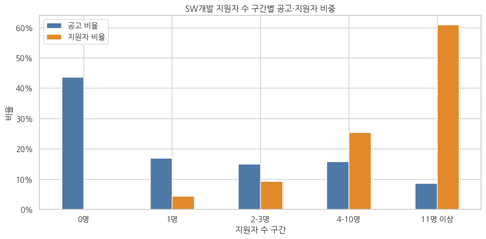
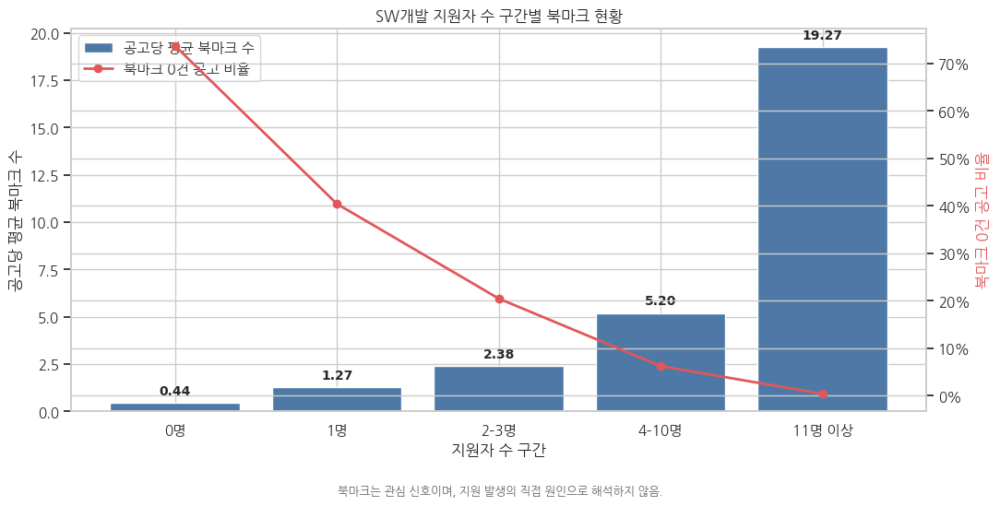
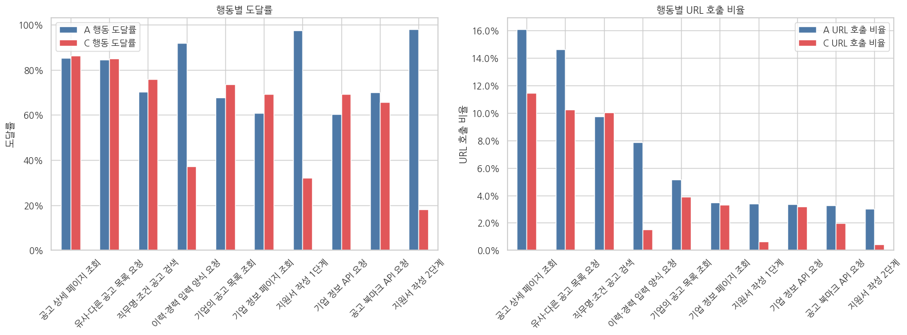

# 채용 플랫폼 북마크 이후 지원 행동 분석

**2022–2023년 채용 플랫폼의 공고·지원·북마크·URL 로그를 연결해 SW 개발 직무의 지원 쏠림과 북마크 이후 행동을 분석한 팀 프로젝트입니다.**

코드잇 스프린트 데이터 분석가 16기 · Part 2 중급 1 · R-AMEN · 최종 보고서 2026.08.11

| 핵심 결과 | 관찰 내용 |
|---|---|
| 전체 공고 32,663건 | 지원자 0명 공고가 51.3% |
| SW 개발 공고 13,324건 | 전체 공고의 40.8%, 공고별 지원자 수 합계의 68.8% |
| SW 공고의 8.7% | 지원자 11명 이상 공고에 SW 지원자 수 합계의 60.9% 집중 |
| 지원 준비 행동의 차이 | 로그 관찰 사용자 중 이력·경력 양식 도달률: 동일 공고 지원 A 91.9%, 미지원 C 37.3% |

> 수치는 제공된 최종 보고서와 통합 노트북의 집계 결과를 기준으로 정리했습니다. 원본 데이터로 새로 계산한 결과가 아닙니다. 지원자 수 합계는 공고별 고유 지원자 수의 합이며 플랫폼 전체 고유 사용자 수와 다릅니다.

[분석 노트북](notebooks/bookmark_analysis.ipynb) · [최종 보고서](docs/final_report.pdf) · [발표 자료](docs/presentation.pdf) · [데이터 안내](data/README.md)

## 프로젝트 개요와 문제 정의

공고를 올리는 것만으로 지원이 발생하지 않는 상황에서, 어떤 공고와 사용자 행동을 우선 살펴봐야 할지 탐색했습니다. 전체 직무 현황에서 규모가 큰 SW 개발 직무를 선정하고, 플랫폼이 후속 행동을 도울 수 있는 접점인 북마크에 집중했습니다.

분석 질문은 공고별 지원 분포, 기업·공고 특성과 지원의 관련성, 북마크 이후 동일 공고 지원·다른 공고 지원·미지원 사용자의 행동 차이입니다. 분석 목표는 지원 활성화 실험의 근거를 마련하는 것이며 채용 성과나 실험 효과를 입증하는 것은 아닙니다.

## 데이터와 분석 단위

| 항목 | 기준 |
|---|---|
| 출처 | 교육 과정에서 제공된 채용 플랫폼 MySQL 데이터 |
| 기간 | 2022-01-01 00:00 이상, 2024-01-01 00:00 미만(KST) |
| 주요 테이블 | Job, Application, JobBookmark, Company, CompanyFund, Log_2022, Log_2023 |
| 단위 | 공고 / 사용자–공고 조합 / URL 요청 이벤트 |
| 핵심 KPI | 분석 기간 내 공고별 고유 지원자 수 |
| 중복 기준 | 동일 사용자·동일 공고 지원은 중복 제거, 서로 다른 공고 지원은 각각 집계 |

원본 덤프는 약 2.39GB이며 개별 식별자·행동 기록과 재배포 범위 문제로 공개에서 제외했습니다. [테이블 구조](sql/schema.sql)와 [입력 파일 목록](notebooks/README.md)을 제공합니다.

## 전처리와 파생변수

| 처리 | 기준과 결과 |
|---|---|
| 시간 | UTC 원본을 보존하고 KST 분석 시각 생성 |
| 공고 기간 | 144,247건 중 분석 기간 대상 32,677건 선정, 시작일이 종료일보다 늦은 14건 제외 → 32,663건 |
| 날짜 결측 | start_date 11,160건은 cdate로 대체, end_date 결측 4,129건은 보존 |
| 이상치 | 지원자 수·게시 기간 IQR 상한 초과에 플래그 생성 후 보존 |
| 로그 | 보고서의 분석 대상 1,933,979건 중 2xx 성공 응답 1,931,405건 사용(99.87%) |
| 투자액 | USD를 1,200원 고정 기준으로 변환한 분석상 가정 사용 |
| 지역 | 주소 정제, 중복 조인 위험이 있는 CompanyAddress 연결 제외 |

지원자 수 구간(0 / 1 / 2–3 / 4–10 / 11명 이상), 공고 게시 기간, 월, 연봉·투자정보 공개 여부, 인턴·신입·경력 포함 여부, URL 행동 유형, 북마크 후 지원 여부·소요시간을 파생했습니다. 보고서의 로그 건수는 원본 덤프 전체 로그 규모를 뜻하지 않습니다.

## 분석 방법

전체 현황 → 직무별 비교 → SW 개발 공고 구간 비교 → 북마크 지표 비교 → 북마크 이후 사용자 세그먼트 → A·C 행동 비교 순서로 EDA를 수행했습니다. Python·pandas로 집계하고 Matplotlib·seaborn으로 시각화했습니다. 원천 데이터는 MySQL 형식으로 제공됐습니다.

H1은 지원자가 많은 공고에서 사전 설정한 기업·공고 지표가 모두 높은지를 비교했고 일부 지표에서만 방향이 일치했습니다. H2는 지원자 수 구간별 평균 북마크 수가 높아지는지를 비교했습니다. 이 판단은 기술통계상 패턴에 관한 것으로 유의성 검정이나 인과 효과의 입증과 구분합니다.

## 핵심 결과

### 1. 지원은 일부 공고에 집중됐습니다

전체 공고 32,663건의 공고별 지원자 수 합계는 74,304건이며 중앙값은 0명입니다. SW 개발에서는 아래와 같은 분포를 보였습니다.

| 공고별 지원자 구간 | 공고 수 | 공고 비중 | 지원자 수 합계 비중 | 평균 북마크 수 |
|---|---:|---:|---:|---:|
| 0명 | 5,810 | 43.6% | 0.0% | 0.44 |
| 1명 | 2,253 | 16.9% | 4.4% | 1.27 |
| 2–3명 | 1,993 | 15.0% | 9.3% | 2.38 |
| 4–10명 | 2,108 | 15.8% | 25.4% | 5.20 |
| 11명 이상 | 1,160 | 8.7% | 60.9% | 19.27 |



### 2. 북마크가 많은 구간에서 지원도 많이 관찰됐습니다

평균 북마크 수는 0명 구간 0.44건에서 11명 이상 구간 19.27건으로 증가했습니다. 북마크 0건 공고 비중은 73.7%에서 0.3%로 낮아졌습니다. 원격근무·연봉 공개 등 모든 특성이 같은 방향으로 증가하지는 않았습니다. 북마크는 추가 분석할 관심 행동으로 선정했으며 지원을 증가시키는 원인으로 단정하지 않았습니다.



### 3. 미지원 집단에도 탐색 행동이 관찰됐습니다

| 세그먼트 | 정의 | 전체 사용자 | 로그 관찰 사용자(관찰률) |
|---|---|---:|---:|
| A | 북마크한 동일 SW 공고에 지원 | 1,972 | 1,970 (99.9%) |
| B | 해당 공고 미지원 후 다른 SW 공고 지원 | 1,809 | 1,809 (100.0%) |
| C | 해당 공고 미지원, 북마크 후 30일 내 다른 SW 공고도 미지원 | 6,285 | 1,845 (29.4%) |

보고서의 A 상위 10개 행동을 기준으로 로그 관찰 사용자 중 각 행동을 1회 이상 보인 비율을 비교했습니다.

| 행동 도달률 | A | C |
|---|---:|---:|
| 공고 상세 조회 | 85.3% | 86.2% |
| 직무·조건 검색 | 70.3% | 75.9% |
| 이력·경력 양식 요청 | 91.9% | 37.3% |
| 지원서 작성 1단계 | 97.4% | 32.2% |
| 지원서 작성 2단계 | 98.1% | 18.1% |



관찰된 C 사용자도 공고 탐색을 했지만 지원 준비 관련 요청은 적었습니다. 이 수치는 단계별 퍼널 전환율이 아니며, API 요청을 실제 작성 완료로 해석하지 않습니다. C의 로그 관찰률이 낮아 전체 미지원 사용자로 일반화할 수 없습니다.

## 운영 제안과 후속 검증

북마크 후 24시간 동안 동일 공고에 지원하지 않은 사용자에게 지원 바로가기와 이력서 작성 안내를 제공하는 방안을 제안했습니다. 사용자를 무작위 배정하는 A/B 테스트에서 메시지 발송 후 7일 또는 30일 내 동일 공고 지원 완료율을 확인할 수 있습니다.

알림 해제·플랫폼 이탈과 지원 쏠림을 함께 점검해야 합니다. 이는 후속 실험 제안이며 실제 테스트 실행이나 전환율 개선 실적은 없습니다.

## 본인 기여

**이창준 · PL(프로젝트 리더)** — 최종 보고서 표지에 명시된 역할입니다. 상세 업무 분담이나 개인별 코드 작성 범위는 제공 자료만으로 확인되지 않아, 전처리·분석·시각화 전체를 개인 성과로 기재하지 않았습니다. 위 분석과 제안은 R-AMEN 팀의 공동 산출물입니다.

## 한계와 개선점

- 관찰자료이므로 북마크·지원 준비 행동이 지원을 유발했다는 결론을 내릴 수 없습니다. 결과로 나눈 A·C 집단에는 선택 편향이 있습니다.
- A·C 로그 관찰률 차이가 크고, 로그가 없는 사용자를 무행동·이탈로 볼 수 없습니다.
- URL에 공고 ID가 안정적으로 남지 않아 중간 행동을 북마크한 특정 공고에 귀속하기 어렵습니다. A 상위 10개 행동 기준 비교는 두 집단 전체 행동의 대칭 비교가 아닙니다.
- 지원 이후 채용·매칭 품질은 분석하지 않았습니다. 실제 전환 개선은 실험으로 검증해야 합니다.
- 가공 CSV 생성에 필요한 전체 추출 SQL과 환경 버전이 없어 공개 저장소만으로 처음부터 결과를 재현할 수 없습니다. 원본 덤프에서 분석용 입력까지의 준비 단계를 추가하는 것이 다음 보완 과제입니다.

## 저장소 구조

```text
job-platform-bookmark-analysis/
├── README.md
├── requirements.txt
├── .gitignore
├── notebooks/
│   ├── bookmark_analysis.ipynb
│   └── README.md
├── docs/
│   ├── final_report.pdf
│   └── presentation.pdf
├── images/
│   ├── applicant_distribution.png
│   ├── bookmark_by_applicants.png
│   └── segment_action_comparison.png
├── data/README.md
└── sql/schema.sql
```

보고서·발표 PDF는 제공된 원본을 그대로 보존했습니다. 노트북은 공개용 사본이며 내부 Drive 파일 ID와 개별 레코드 출력을 제거했습니다. README 이미지들은 원본 노트북의 저장된 그래프에서 추출했습니다. 변경 범위와 실행 방법은 [노트북 안내](notebooks/README.md)를 참고하세요.
